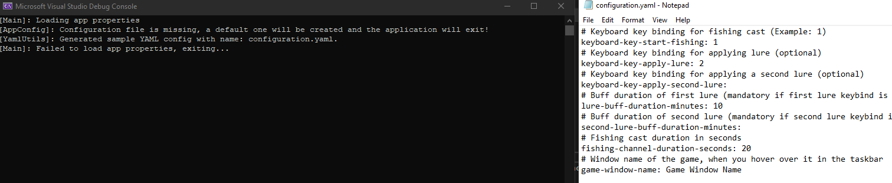
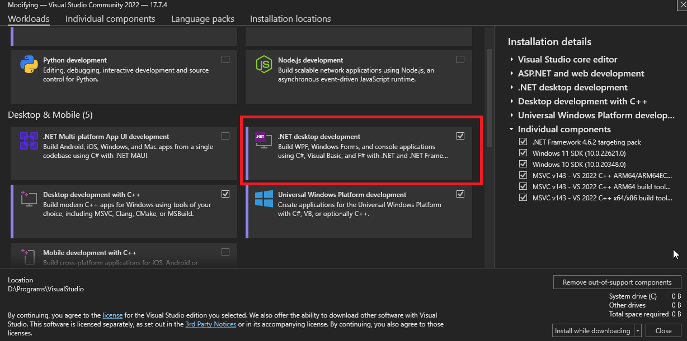
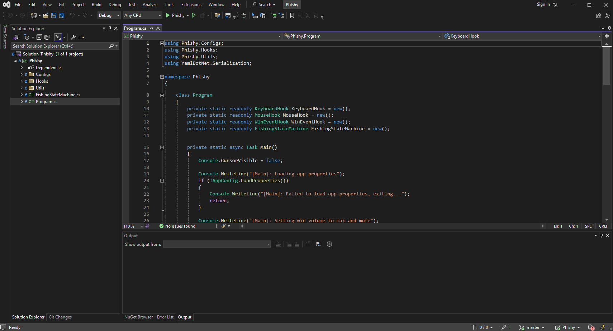

<!-- Improved compatibility of back to top link: See: https://github.com/othneildrew/Best-README-Template/pull/73 -->
<a name="readme-top"></a>

<h3 align="center">Phishy</h3>

<p align="center"> :warning:<b>USE AT YOUR OWN RISK</b>:warning:</p>

  <p align="center">
    A universal, <i>different</i>, undetectable at time of writing, out-of-process World of Warcraft fishing bot. This project is a better looking, configurable, continuation of my C++ PoC: https://github.com/stdNullPtr/wow-fishbot
    <br />
    <a href="https://github.com/stdNullPtr/Phishy"><strong>Explore the docs »</strong></a>
    <br />
    <br />
    <a href="https://github.com/stdNullPtr/Phishy/issues">Report Bug</a>
    ·
    <a href="https://github.com/stdNullPtr/Phishy/issues">Request Feature</a>
  </p>
</div>


<!-- TABLE OF CONTENTS -->
<details>
  <summary>Table of Contents</summary>
  <ol>
    <li>
      <a href="#about-the-project">About The Project</a>
      <ul>
        <li><a href="#built-with">Built With</a></li>
      </ul>
    </li>
    <li>
      <a href="#getting-started">Getting Started</a>
      <ul>
        <li><a href="#prerequisites">Prerequisites</a></li>
        <li><a href="#compiling">Compiling</a></li>
      </ul>
    </li>
    <li><a href="#usage">Usage</a></li>
    <li><a href="#contributing">Contributing</a></li>
    <li><a href="#todos">TODOs</a></li>
    <li><a href="#license">License</a></li>
  </ol>
</details>


## About The Project



This unique fishbot works by cleverly utilizing WinAPI functions to bypass detection and stay out-of-process.
<br>
The entire main loop follows an implementation of the State Machine architecture.
<br>
Bot structure:
 - **The 'eyes'** of the bot are the cursor name change events when we hover the bobber: https://learn.microsoft.com/en-us/windows/win32/winauto/event-constants#:~:text=EVENT_OBJECT_NAMECHANGE
 - **The 'brain'** is the main loop state machine
 - **The 'ears'** are the Windows sounds when the bobber splashes
 - **The 'hands'** are simple mouse-click events

With this set up we manage to stay out of the process, and we are able to use the bot in **any** game that follows the same fishing logic.

<p align="right">(<a href="#readme-top">back to top</a>)</p>


### Built With

* C# (.NET Desktop)

<p align="right">(<a href="#readme-top">back to top</a>)</p>


<!-- GETTING STARTED -->
## Getting Started


### Prerequisites

This is an example of how to list things you need to use the software and how to install them.
* Make sure you have Visual Studio (preferably 2022)
* Make sure through the VS installer you select .NET desktop 
* Clone the project
```sh
git clone https://github.com/stdNullPtr/Phishy
```

### Compiling

1. Open the project in Visual Studio (using the .sln file), you should see something similar: 
2. Build (ctrl + shift + B) to verify you can build properly
3. You can find the binaries in '(project root)\Phishy\bin\Debug\net7.0-windows'
The executable is named "guess.exe" just for the sake of the name being somewhat random.

<p align="right">(<a href="#readme-top">back to top</a>)</p>


<!-- USAGE EXAMPLES -->
## Usage

1. Config<br>
   The process requires a configuration.yaml file in order to start.
   If one isn't present in the same directory as the .exe, a sample will be created and opened for editing.
   The process will exit but you can now edit the text file that opened, adding your configuration for the fishbot depending on the WoW version and keybinds.
   Once started, the program will mute your windows sound and set it to max volume, in preparation for listening for the bobber.

3. An example fishing setup with the default settings in the config file:
   - place the fishing cast on keybind '1'
   - place the lure on keybind '2'
   - set game window name to 'game-window-name: World of Warcraft' if you are on WotLK
   - position yourself in a fishing spot
   - max zoom in
   - set game sound volume to ~80%, disable ambient sounds
   - cast manually fishing a few times to make sure that the bobber lands somewhere around the middle of the screen
   - make sure you are alone and in a quiet place, the bot will listen for a splash
   - start the fishbot, focus wow window, observe
   - let go of the mouse and keyboard
   - stop by pressind DEL

<p align="right">(<a href="#readme-top">back to top</a>)</p>


<!-- CONTRIBUTING -->
## Contributing

Contributions are what make the open-source community such an amazing place to learn, inspire, and create. Any contributions you make are **greatly appreciated**.

If you have a suggestion that would make the bot better, please fork the repo and create a pull request. You can also simply open an issue with the tag "enhancement".
Don't forget to give the project a star! Thanks again!

1. Fork the Project
2. Create your Feature Branch (`git checkout -b feature/AmazingFeature`)
3. Commit your Changes (`git commit -m 'Add some AmazingFeature'`)
4. Push to the Branch (`git push origin feature/AmazingFeature`)
5. Open a Pull Request

<p align="right">(<a href="#readme-top">back to top</a>)</p>

## TODOs
* Introduce a graphical UI
* Add better instructions (possibly video)

<p align="right">(<a href="#readme-top">back to top</a>)</p>

<!-- LICENSE -->
## License

Distributed under the MIT License. See `LICENSE.txt` for more information.

<p align="right">(<a href="#readme-top">back to top</a>)</p>
